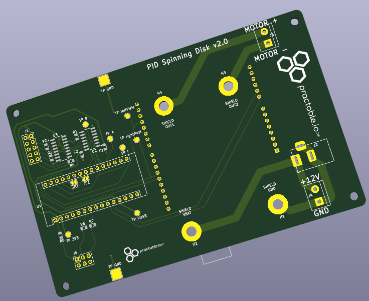

# spinner-amax

Spinner experiment with Maxxon AMAX 32 motor, upgraded for 2022 usage by Controls and Instrumentation 3, School of Engineering, University of Edinburgh. This design has now been used for over 2,500 hours in total across 12 separate instances. We have now expanded the fleet to 48 experiments, with 12 different weights (four of each).

You can cite the contents of this repo via this paper:

D.Reid, J. Burridge, D. Lowe, T. Drysdale "Open-source remote laboratory experiments for controls engineering education," _International Journal of Mechanical Engineering Education_, February 2022, [doi:10.1177/03064190221081451](https://journals.sagepub.com/doi/full/10.1177/03064190221081451)

<figure>

<figcaption align = "center"><b>Fig. 2. Spinner hardware using AMAX motor</b></figcaption>
</figure>

## Contents

  - Firmware `./fw`
  - Hardware `./hw`
  - Printed Circuit Board `./hw/pcb`
  - Single Board Computer `./sbc`
  - UI `./ui`
   
## Hardware

For drawings/CAD please look [here](./hw/cad).

### Motor

The experiment is now using an AMAX 32 motor variant (part number: 236668)


The technical specs are [here](./hw/doc/EN-21-176.pdf/)

### Weights

The latest iteration of the weights includes attention to reducing eccentricity to reduce side load on the motor bearings.

### Previous hardware version

The first version of the hardware used a motor with siginficantly more friction, which is educationally useful although increases the challenge level for students just learning the control theory for the first time because the variability induced by the friction can obscure the presence/absence about steady state errors. Hardware details:  [spinner-nidec](https://github.com/practable/spinner-nidec).

## Performance

The varaibility of the step response is reduced significantly compared to the spinner using the nidec motor.
Meanwhile, here is a measured step response (average of seven runs)


## PCB




## SBC

The scripts to setup your single board computer (in this case, a Raspberry Pi 4 Model B). See the [SBC README](./sbc/README.md) for instructions.

### Token refresh

Refreshing the tokens after installation is a manual process, because shell-relay currently cannot handle ansible connections.

#### Procedure

Use the configure script in `spinner-amax/sbc/scripts` to generate new tokens

```
./configure spin 30 41 https://relay-access.practable.io https://shell-access.practable.io https://shell-access2.practable.io
```

ssh into the spinners one by one (either using the shell-relay connection, or directly). If the shell tokens have expired, then a direct connection is the only option.

```
sudo su
cd /etc/practable
cat data.access #check which experiment 
rm *.token
nano data.token #copy in the token from file in ../autogenerated
nano video.token #copy in token from the file in ../autogenerated
systemctl restart session-rules
cd /usr/local/bin
mv shell shell-relay
cd /etc/systemd/system
systemctl disable shellhost #let's not use the old version any more
nano shellhost2.service #copy in file from ../autogenerated
systemctl enable shellhost2.service
systemctl start shellhost2.service
```

then check the connections to the servers

```
# in admin-tools on admin machine
./sessionrelay/getSessionStats.sh | grep spin
./shellrelay/getShellStats2.sh | grep spin
```


